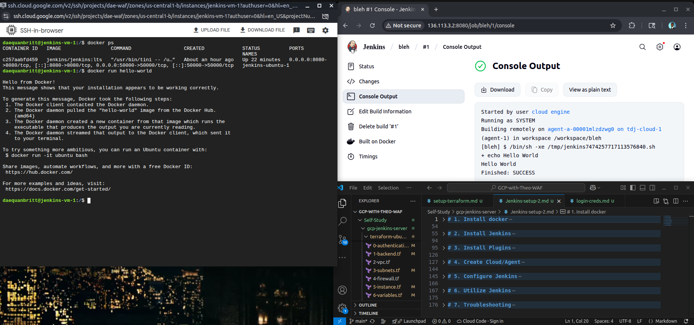

# Jenkins on GCP — Terraform‑Only or Docker Path



This repository lets you stand up a Jenkins environment on Google Cloud Platform in **two different ways**:

1) **Terraform‑only**: Provision a VM/network with Terraform and install Jenkins directly on the VM.  
2) **Docker**: Install Docker on the VM and run Jenkins as a container.

Pick the path that fits your workflow and comfort level. Both are documented below.

---

## Prerequisites

- A GCP project with billing enabled  
- `gcloud` CLI authenticated to that project  
- Terraform installed (v1.5+ recommended)  
- A Google Cloud service account with appropriate permissions (see **Attach a Service Account to the VM** below) 

---

## Repo Layout (Terraform)

These files define the core infrastructure:

- `0-authentication.tf` — provider auth blocks and project configuration
- `1-backend.tf` — remote state backend (e.g., GCS) for Terraform state
- `2-vpc.tf` — VPC creation
- `3-subnets.tf` — Subnet(s) by region
- `4-firewall.tf` — Firewall rules (e.g., allow SSH/HTTP/HTTPS/Jenkins)
- `5-instance.tf` — Compute Engine VM, disks, service account scopes, metadata
- `6-variables.tf` — Input variables for the stack

Create a `terraform.tfvars` (or use `-var-file`) with your values, e.g.:

```hcl
project = "my-first-project"
region  = "us-central1"
zone    = "us-central1-b"
vpc     = "jenkins-cloud"
```

> If Terraform asks for variables you already put in `terraform.tfvars`, ensure the file is in the same directory you run commands from and is named exactly `terraform.tfvars`. You can also pass `-var-file=terraform.tfvars` explicitly.

---

## Path A — Terraform‑Only (Install Jenkins on the VM)

### 1) Initialize and apply Terraform

```bash
terraform init
terraform plan
terraform apply
```

Wait for the VM to finish provisioning, then SSH to it (via Cloud Console or `gcloud compute ssh`).

### 2) Install Java and Jenkins on the VM

Follow the “Terraform‑only” Jenkins setup notes (Java, apt repo, Jenkins install, and first‑time unlock).  
Key steps include:

- Install Java (OpenJDK 17) and add the Jenkins apt repo
- `sudo apt-get update && sudo apt-get install jenkins`
- Check service: `sudo systemctl status jenkins`
- Browse to `http://<VM_EXTERNAL_IP>:8080` and unlock Jenkins using the initial admin password  
  (e.g., `/var/lib/jenkins/secrets/initialAdminPassword`) 

### 3) Customize Jenkins

Once unlocked, choose “Install suggested plugins” or pick the plugins you need.

---

## Path B — Docker (Run Jenkins in a Container)

### 1) Install Docker Engine

- Remove conflicting packages if present
- Add Docker’s apt repo and GPG key
- Install Docker Engine and verify the service is running
- (Optional) Add your user to the `docker` group  
Full, step‑by‑step commands are documented here. 

### 2) Run Jenkins via Docker

Use a persistent volume for Jenkins home and start the container:

```bash
docker run -d   -p 8080:8080 -p 50000:50000   -v /root/jenkins_home:/var/jenkins_home   -u root   --name jenkins-ubuntu-1   --privileged=true   -v /var/run/docker.sock:/var/run/docker.sock   jenkins/jenkins:lts
```

- `-d` runs it detached
- `-p` exposes UI (8080) and inbound agents (50000)
- `-v` mounts host storage into the container for Jenkins config and access to Docker
- `--name` sets a human‑friendly container name  
Find the initial admin password at `/root/jenkins_home/secrets/initialAdminPassword`, then open `http://<VM_EXTERNAL_IP>:8080` to finish setup. 

### 3) (Optional) Jenkins + Docker Cloud/Agent

If you’ll launch ephemeral Docker agents from Jenkins:

- **Manage Jenkins → Plugins**: install **Docker** plugin  
- Restart the Jenkins container: `docker restart jenkins-ubuntu-1`  
- **Manage Jenkins → Clouds → New Cloud (Docker)**  
  - Docker Host URL: `unix:///var/run/docker.sock`  
  - Add a Docker agent template, choose image (e.g., `jenkins/jenkins:lts`), and connect as `root`  
Then label the template and restrict jobs to that label in each job’s **Configure** page. 

---

## Attach a Service Account to the VM (Recommended)

To let Jenkins (on the VM) access GCP resources (e.g., Terraform/`gcloud` on the VM), create and attach a service account:

1) **Create the service account**
```bash
gcloud iam service-accounts create jenkins-sa   --display-name="Jenkins Terraform Service Account"
```

2) **Grant roles**
```bash
gcloud projects add-iam-policy-binding $PROJECT_ID   --member="serviceAccount:jenkins-sa@${PROJECT_ID}.iam.gserviceaccount.com"   --role="roles/compute.networkAdmin"

gcloud projects add-iam-policy-binding $PROJECT_ID   --member="serviceAccount:jenkins-sa@${PROJECT_ID}.iam.gserviceaccount.com"   --role="roles/compute.instanceAdmin.v1"
```

3) **Attach to the VM**
```bash
gcloud compute instances stop $JENKINS_VM --zone=$ZONE

gcloud compute instances set-service-account $JENKINS_VM   --zone=$ZONE   --service-account=jenkins-sa@${PROJECT_ID}.iam.gserviceaccount.com   --scopes=https://www.googleapis.com/auth/cloud-platform

gcloud compute instances start $JENKINS_VM --zone=$ZONE
```

Use `gcloud auth list` to verify. 

---

## Common Troubleshooting

- **“Unable to locate package openjdk-11-jdk”**  
  Run `sudo apt-get update` first, or install the OpenJDK 17 package as shown in the Terraform‑only notes. 

- **Can’t reach Jenkins UI**  
  Ensure firewall rules allow TCP 8080 from your IP. Confirm VM external IP is correct and the service/container is running.

- **Docker not running**  
  Check `sudo systemctl status docker`, start it if needed, and verify with `docker run hello-world`. 

- **Plugins not taking effect (Docker path)**  
  Restart the container: `docker restart jenkins-ubuntu-1`. 

- **Terraform variables not picked up**  
  Ensure `terraform.tfvars` is in the working directory or pass `-var-file`. Confirm variable names match those in `6-variables.tf`.

---

## Clean Up

When you’re done:
```bash
# Terraform
terraform destroy

# Docker (if used)
docker rm -f jenkins-ubuntu-1
```

---

## Notes

- The Terraform path gives you a classic VM install of Jenkins managed by `systemd`.  
- The Docker path provides easy upgrades/rollbacks and isolation of Jenkins from the host OS.  
- You can mix approaches: use Terraform to create the VM/network and then choose to install Jenkins either directly (Terraform‑only steps) or via Docker.

Happy building!  
